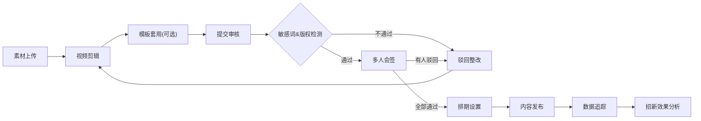

## 1. 产品概述
面向高校社团的短视频招新内容管理平台，一站式解决社团招新视频的素材管理、剪辑制作、模板套用、排期发布、内容审核、数据分析及团队协作问题。
- 目标用户：高校社团宣传团队、社团负责人、招新筹备组
- 核心价值：降低短视频制作门槛，规范招新内容流程，提升招新效率与数据可追溯性

## 2. 核心功能

### 2.1 用户角色
| 角色 | 注册方式 | 核心权限 |
|------|----------|----------|
| 超级管理员 | 后台创建 | 所有权限，成员管理，权限分配 |
| 编辑 | 邀请加入 | 素材上传、视频剪辑、模板使用、内容提交 |
| 审核员 | 邀请加入 | 内容审核、敏感词检查、版权确认、多人会签 |
| 发布员 | 邀请加入 | 排期设置、发布、置顶、下架操作 |
| 只读成员 | 邀请加入 | 查看素材、视频、数据，无编辑权限 |

### 2.2 功能模块
1. **素材库页面**：视频上传、图片上传、字幕上传、音乐上传、素材分类管理、素材搜索预览
2. **剪辑页面**：视频裁切、多段拼接、封面设置、贴纸添加、实时预览
3. **模板页面**：社团介绍模板、活动回顾模板、报名引导模板、模板预览与一键套用
4. **排期页面**：发布时间设置、置顶开关、下架时间、发布队列管理
5. **审核页面**：敏感词检测、版权提示、多人审核确认、审核意见记录
6. **数据页面**：播放量统计、点赞数、转发数、报名点击量、留资来源分析
7. **成员页面**：成员列表、角色分配（编辑/审核/发布/只读）、操作日志记录

### 2.3 页面详情
| 页面名称 | 模块名称 | 功能描述 |
|----------|----------|----------|
| 素材库 | 上传区 | 拖拽上传视频/图片/字幕/音乐，支持批量上传与进度显示 |
| 素材库 | 素材列表 | 网格布局展示，按类型筛选，支持搜索、标签、删除 |
| 素材库 | 素材预览 | 视频/图片预览弹窗，字幕在线查看，音乐试听 |
| 剪辑页 | 时间轴 | 多轨道时间轴，支持拖拽排序、裁切分割、拼接 |
| 剪辑页 | 封面设置 | 从视频帧选取或上传自定义封面图 |
| 剪辑页 | 贴纸面板 | 预设贴纸库，支持拖拽添加、缩放、定位、删除 |
| 剪辑页 | 实时预览 | 播放器实时预览剪辑效果 |
| 模板页 | 模板分类 | 社团介绍/活动回顾/报名引导三大分类切换 |
| 模板页 | 模板卡片 | 缩略图预览、模板名称、风格标签、使用次数 |
| 模板页 | 模板详情 | 全屏预览、一键套用至剪辑器 |
| 排期页 | 发布设置 | 发布时间选择器、置顶开关、自动下架时间 |
| 排期页 | 发布队列 | 待发布/已发布/已下架列表，支持快速操作 |
| 审核页 | 敏感词检测 | 自动扫描标题、描述、字幕中的敏感词并高亮 |
| 审核页 | 版权校验 | BGM、图片、字体版权状态提示与风险警示 |
| 审核页 | 多人会签 | 审核员列表、通过/驳回操作、审核意见填写 |
| 数据页 | 核心指标 | 播放、点赞、转发、报名点击总数卡片 |
| 数据页 | 趋势图表 | 近7天/30天各指标折线图与柱状图 |
| 数据页 | 留资来源 | 渠道来源饼图、TOP视频排名 |
| 成员页 | 成员管理 | 成员列表、搜索、添加/移除成员 |
| 成员页 | 角色分配 | 下拉选择角色（编辑/审核/发布/只读），实时切换 |
| 成员页 | 操作日志 | 按时间倒序展示操作记录，支持筛选 |

## 3. 核心流程
社团编辑从素材库上传视频、图片、字幕、音乐素材，进入剪辑页进行裁切、拼接、添加封面和贴纸，可选择套用模板快速生成。完成剪辑后提交审核，审核员对内容进行敏感词检测、版权校验并多人会签确认。审核通过后，发布员在排期页设置发布时间、置顶和下架策略，内容按计划发布。数据页持续追踪播放、点赞、转发、报名点击和留资来源等关键指标，为后续招新策略提供数据支撑。成员页由管理员统一管理团队角色权限并追溯所有操作记录。

## 4. 用户界面设计

### 4.1 设计风格
- **主色调**：深靛蓝 `#1E3A8A`（稳重专业）、活力橙 `#F97316`（青春活力）
- **辅助色**：浅灰 `#F1F5F9`、中灰 `#94A3B8`、成功绿 `#10B981`、警示红 `#EF4444`
- **按钮风格**：圆角 8px，主按钮实色渐变，次按钮描边，悬停微上浮 + 阴影加深
- **字体**：标题使用 "Noto Serif SC" 展示字体，正文使用 "Noto Sans SC"，数字使用 "JetBrains Mono"
- **布局风格**：左侧导航栏 + 顶部面包屑 + 右侧主内容区卡片式布局
- **图标风格**：线性图标 Lucide React，统一 20px 尺寸，1.5px 线宽

### 4.2 页面设计概览
| 页面名称 | 模块名称 | UI 元素 |
|----------|----------|---------|
| 素材库 | 上传区 | 虚线拖拽框、文件类型图标、上传进度条、渐变按钮 |
| 素材库 | 素材列表 | 卡片网格、悬停放大、类型角标、选中态边框 |
| 剪辑页 | 时间轴 | 深色轨道背景、彩色片段块、拖拽手柄、缩放滑块 |
| 剪辑页 | 预览区 | 圆角播放器、播放控制条、帧选择缩略图 |
| 模板页 | 模板卡片 | 悬浮封面、风格标签、使用数徽章、一键套用角标 |
| 排期页 | 时间轴 | 日历时间轴、不同状态色块、拖拽调整时间 |
| 审核页 | 检测面板 | 敏感词红色高亮、版权状态徽章、进度环 |
| 数据页 | 指标卡片 | 渐变色数字、趋势小箭头、背景微纹理 |
| 成员页 | 权限矩阵 | 角色标签、开关切换、操作日志时间线 |

### 4.3 响应式
- 桌面优先设计（≥ 1280px），针对 1440px 优化
- 平板端（≥ 768px）：左侧导航折叠为图标模式，内容区自适应
- 移动端（< 768px）：底部 Tab 导航，卡片单列布局，上传区简化
