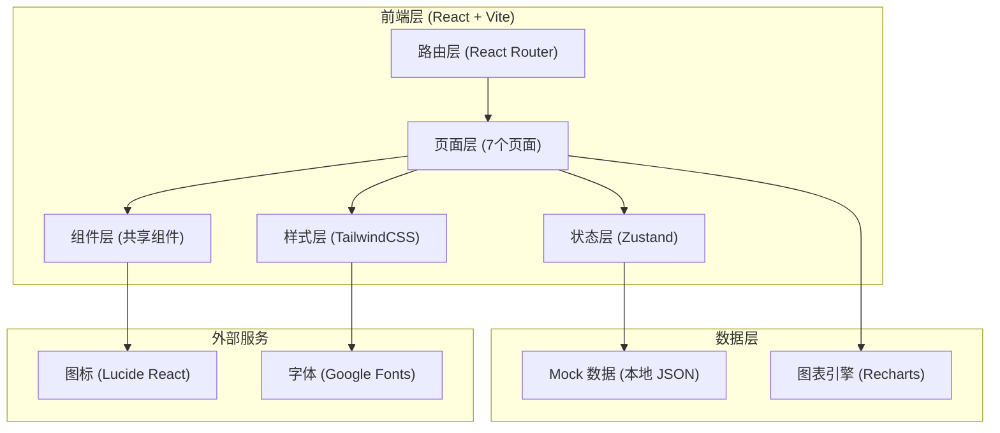

## 1. 架构设计



## 2. 技术描述
- **前端框架**：React@18 + TypeScript@5
- **构建工具**：Vite@5
- **样式方案**：TailwindCSS@3.4 + PostCSS + Autoprefixer
- **路由管理**：React Router DOM@6
- **状态管理**：Zustand@4（轻量全局状态）
- **UI 图标**：Lucide React@0.344
- **图表库**：Recharts@2（数据可视化）
- **后端**：无，全部使用 Mock 数据模拟
- **数据存储**：本地 JSON + localStorage 持久化

## 3. 路由定义
| 路由路径 | 页面名称 | 页面用途 |
|----------|----------|----------|
| `/` | 重定向至素材库 | 默认入口 |
| `/materials` | 素材库 | 视频/图片/字幕/音乐上传与管理 |
| `/editor` | 剪辑页 | 视频裁切、拼接、封面、贴纸编辑 |
| `/templates` | 模板页 | 社团介绍/活动回顾/报名引导模板 |
| `/schedule` | 排期页 | 发布时间、置顶、下架设置 |
| `/review` | 审核页 | 敏感词、版权、多人审核流程 |
| `/analytics` | 数据页 | 播放、点赞、转发、报名数据分析 |
| `/members` | 成员页 | 成员管理、角色分配、操作日志 |

## 4. 目录结构
```
src/
├── assets/            # 静态资源（图片、字体等）
├── components/        # 共享组件
│   ├── layout/        # 布局组件（Sidebar、Header、Layout）
│   ├── ui/            # 基础 UI（Button、Card、Modal、Badge、Switch）
│   └── features/      # 业务共享组件（Uploader、Timeline、Player 等）
├── pages/             # 7个页面组件
│   ├── Materials.tsx
│   ├── Editor.tsx
│   ├── Templates.tsx
│   ├── Schedule.tsx
│   ├── Review.tsx
│   ├── Analytics.tsx
│   └── Members.tsx
├── store/             # Zustand 状态管理
│   ├── useMaterialStore.ts
│   ├── useEditorStore.ts
│   ├── useScheduleStore.ts
│   ├── useReviewStore.ts
│   ├── useAnalyticsStore.ts
│   └── useMemberStore.ts
├── mock/              # Mock 数据
│   ├── materials.ts
│   ├── templates.ts
│   ├── schedule.ts
│   ├── reviews.ts
│   ├── analytics.ts
│   └── members.ts
├── types/             # TypeScript 类型定义
│   └── index.ts
├── utils/             # 工具函数
│   ├── format.ts
│   └── constants.ts
├── App.tsx
├── main.tsx
└── index.css
```

## 5. 数据模型

### 5.1 数据模型定义

```mermaid
erDiagram
    MATERIAL {
        string id PK
        string name
        string type "video|image|subtitle|music"
        string url
        number size
        number duration
        string cover
        string[] tags
        string createdAt
    }
    VIDEO_PROJECT {
        string id PK
        string title
        string cover
        string status "draft|reviewing|approved|published|offline"
        Clip[] clips
        Sticker[] stickers
        string templateId
        string createdAt
        string updatedAt
    }
    TEMPLATE {
        string id PK
        string name
        string category "intro|review|signup"
        string thumbnail
        string style
        number usageCount
        string[] clips
    }
    SCHEDULE {
        string id PK
        string videoId
        string title
        string status "pending|published|offline"
        boolean isPinned
        string publishAt
        string offlineAt
    }
    REVIEW {
        string id PK
        string videoId
        string status "pending|approved|rejected"
        SensitiveWord[] sensitiveWords
        CopyrightItem[] copyrights
        ReviewRecord[] records
    }
    ANALYTICS {
        string videoId
        number views
        number likes
        number shares
        number signUpClicks
        DailyData[] daily
        SourceData[] sources
    }
    MEMBER {
        string id PK
        string name
        string avatar
        string email
        string role "admin|editor|reviewer|publisher|viewer"
        string createdAt
    }
    OPERATION_LOG {
        string id PK
        string memberId
        string memberName
        string action
        string target
        string timestamp
    }
```



### 5.2 TypeScript 类型定义

```typescript
export type MaterialType = 'video' | 'image' | 'subtitle' | 'music';
export type MemberRole = 'admin' | 'editor' | 'reviewer' | 'publisher' | 'viewer';
export type VideoStatus = 'draft' | 'reviewing' | 'approved' | 'published' | 'offline';
export type TemplateCategory = 'intro' | 'review' | 'signup';
export type ScheduleStatus = 'pending' | 'published' | 'offline';
export type ReviewStatus = 'pending' | 'approved' | 'rejected';

export interface Material {
  id: string;
  name: string;
  type: MaterialType;
  url: string;
  size: number;
  duration?: number;
  cover?: string;
  tags: string[];
  createdAt: string;
}

export interface Clip {
  id: string;
  materialId: string;
  startTime: number;
  endTime: number;
  track: number;
}

export interface Sticker {
  id: string;
  type: string;
  x: number;
  y: number;
  scale: number;
  startTime: number;
  endTime: number;
}

export interface VideoProject {
  id: string;
  title: string;
  cover: string;
  status: VideoStatus;
  clips: Clip[];
  stickers: Sticker[];
  templateId?: string;
  createdAt: string;
  updatedAt: string;
}

export interface Template {
  id: string;
  name: string;
  category: TemplateCategory;
  thumbnail: string;
  style: string;
  usageCount: number;
}

export interface Schedule {
  id: string;
  videoId: string;
  title: string;
  status: ScheduleStatus;
  isPinned: boolean;
  publishAt: string;
  offlineAt?: string;
}

export interface SensitiveWord {
  word: string;
  location: string;
  level: 'warning' | 'danger';
}

export interface CopyrightItem {
  name: string;
  type: 'bgm' | 'image' | 'font';
  status: 'safe' | 'warning' | 'danger';
  tip: string;
}

export interface ReviewRecord {
  reviewerId: string;
  reviewerName: string;
  action: 'approve' | 'reject';
  comment: string;
  timestamp: string;
}

export interface Review {
  id: string;
  videoId: string;
  status: ReviewStatus;
  sensitiveWords: SensitiveWord[];
  copyrights: CopyrightItem[];
  records: ReviewRecord[];
}

export interface DailyData {
  date: string;
  views: number;
  likes: number;
  shares: number;
  signUpClicks: number;
}

export interface SourceData {
  source: string;
  count: number;
  percentage: number;
}

export interface Analytics {
  videoId: string;
  videoTitle: string;
  views: number;
  likes: number;
  shares: number;
  signUpClicks: number;
  daily: DailyData[];
  sources: SourceData[];
}

export interface Member {
  id: string;
  name: string;
  avatar: string;
  email: string;
  role: MemberRole;
  createdAt: string;
}

export interface OperationLog {
  id: string;
  memberId: string;
  memberName: string;
  action: string;
  target: string;
  timestamp: string;
}
```
